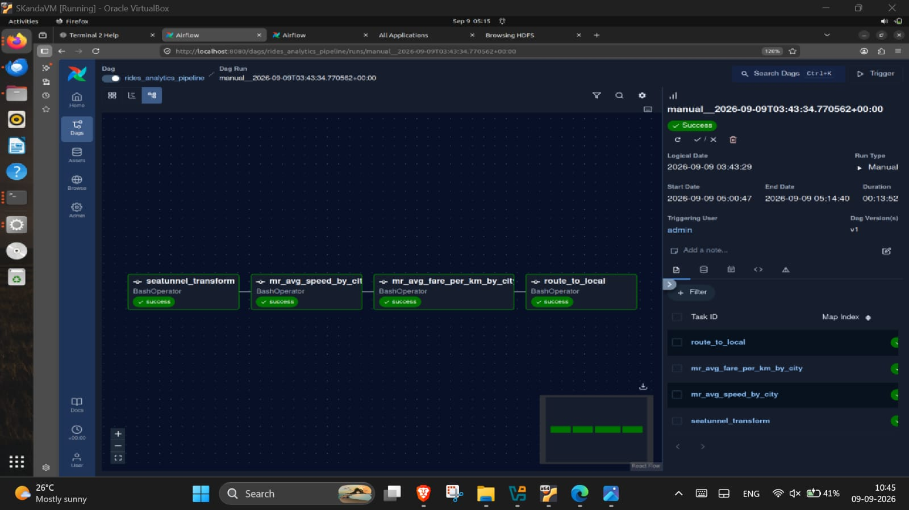
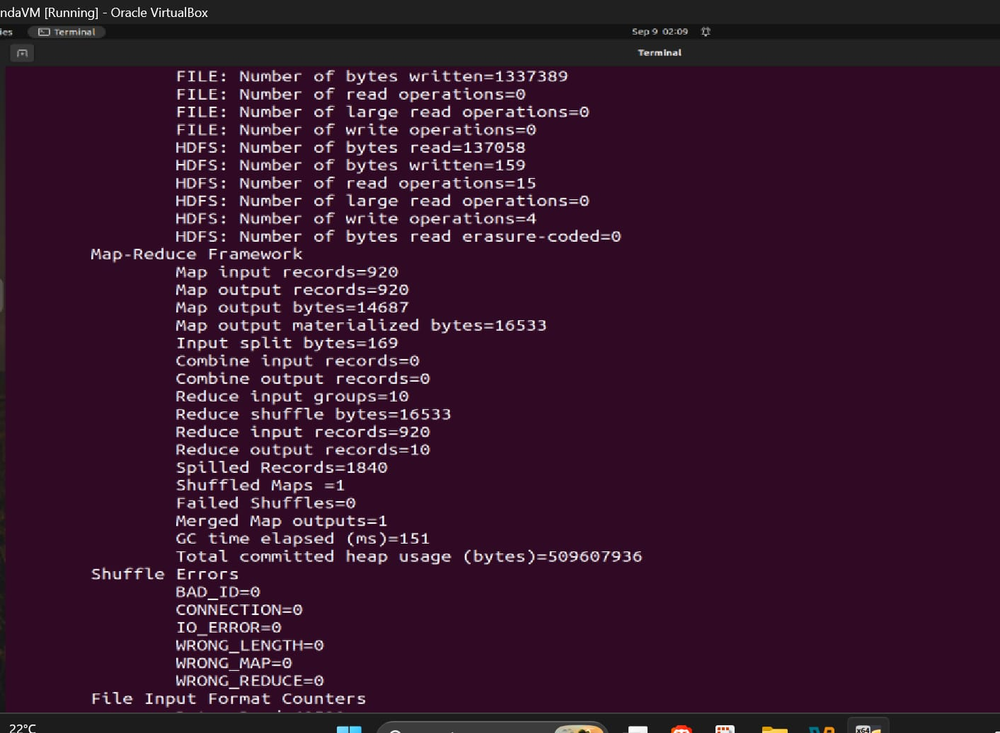
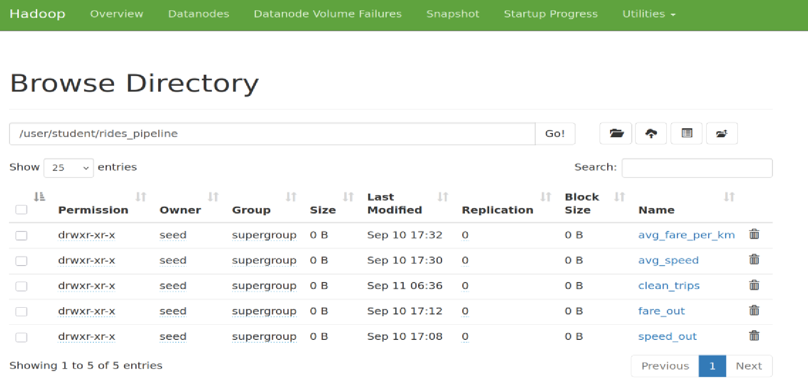
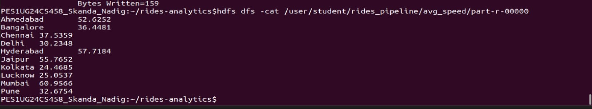
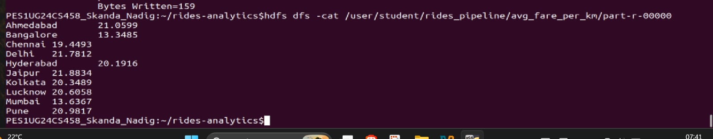
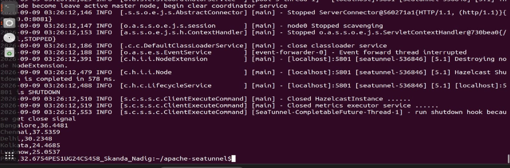
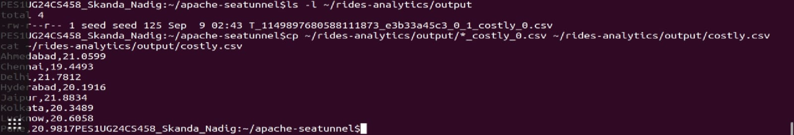
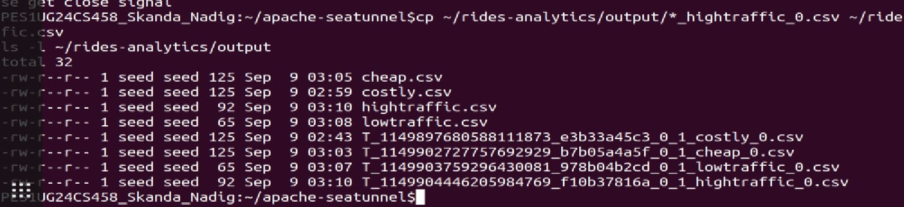

# 🚖 Rides Analytics Pipeline

> **End-to-end Big Data batch pipeline** for ride-hailing trip analytics across **10 Indian cities** — powered by Apache Hadoop (MapReduce + HDFS), Apache SeaTunnel, and Apache Airflow.

<div align="center">



*Apache Airflow DAG: all 4 tasks completed successfully in a single orchestrated run*

</div>

---

## 📑 Table of Contents

1. [Project Overview](#-project-overview)
2. [Tech Stack](#-tech-stack)
3. [Architecture](#-architecture)
4. [Repository Structure](#-repository-structure)
5. [Getting Started](#-getting-started)
6. [Stage-by-Stage Walkthrough](#-stage-by-stage-walkthrough)
7. [Results & Screenshots](#-results--screenshots)
8. [Key Findings](#-key-findings)
9. [Notes](#-notes)

---

## 🌟 Project Overview

| Field | Detail |
|-------|--------|
| **Course** | Big Data (UE24CS343AB2) — 5th Semester |
| **Assignment** | A1 — Batch Pipeline for Ride-Hailing Analytics |
| **Dataset** | 1 000 trip records across 10 Indian cities |
| **Pipeline type** | Batch (no simulation — all tools execute real jobs) |

**What it does:**

1. **Ingests & cleans** raw trip CSV data via Apache SeaTunnel → writes to HDFS
2. **Computes** average speed and average fare/km per city via Hadoop MapReduce
3. **Routes** results into 4 categorised output CSVs via Apache SeaTunnel
4. **Orchestrates** all stages with a single Apache Airflow DAG

---

## 🛠 Tech Stack

| Tool | Role |
|------|------|
| **Apache Hadoop 3.3.6** (HDFS + YARN) | Distributed storage and MapReduce execution |
| **Apache SeaTunnel 2.x** | Data ingestion, transformation, and routing |
| **Apache Airflow 2.x** | Workflow orchestration (DAG scheduling) |
| **Java 8** | MapReduce job implementation |
| **Python 3.8+** | Airflow DAG definitions |

---

## 🏗 Architecture

```
trips.csv
    │
    ▼
┌─────────────────────────────────┐
│  Stage 1 · SeaTunnel            │  clean_load.conf
│  • Drop rows: distance ≤ 0,     │  1000 rows in → 920 rows out
│    missing fare, bad timestamps  │
└────────────────┬────────────────┘
                 │  HDFS: /user/student/rides_pipeline/clean_trips
        ┌────────┴────────┐
        ▼                 ▼
┌──────────────┐  ┌───────────────────────┐
│  Stage 2     │  │  Stage 3              │
│  MapReduce   │  │  MapReduce            │
│  Avg Speed   │  │  Avg Fare/km          │
│  per City    │  │  per City             │
└──────┬───────┘  └──────────┬────────────┘
       │ /avg_speed           │ /avg_fare_per_km
       └──────────┬───────────┘
                  ▼
       ┌──────────────────────┐
       │  Stage 4 · SeaTunnel │  4 conf files
       │  Route to 4 CSVs     │
       └──┬──────┬──────┬──┬──┘
          ▼      ▼      ▼  ▼
      costly  cheap  low  high
      .csv    .csv  traffic traffic
                    .csv   .csv

Orchestrator: Apache Airflow DAG (rides_analytics_pipeline)
  seatunnel_transform → mr_avg_speed_by_city → mr_avg_fare_per_km_by_city → route_to_local
```

---

## 📁 Repository Structure

```
rides-analytics-pipeline/
├── 📂 dags/
│   ├── rides_analytics_pipeline.py   # Main Airflow DAG — all 4 tasks
│   └── hdfs_workflow.py              # HDFS CLI smoke-test DAG
│
├── 📂 src/
│   ├── AvgSpeedByCity.java            # MapReduce Job 1 — average speed
│   └── AvgFarePerKmByCity.java        # MapReduce Job 2 — average fare/km
│
├── 📂 seatunnel/
│   ├── clean_load.conf                # Stage 1 — clean CSV → HDFS
│   ├── costly.conf                    # Stage 4 — fare/km > 17
│   ├── cheap.conf                     # Stage 4 — fare/km ≤ 17
│   ├── lowtraffic.conf                # Stage 4 — avg speed > 45
│   └── hightraffic.conf               # Stage 4 — avg speed ≤ 45
│
├── 📂 seatunnel-verification/
│   ├── employees.csv                  # Smoke-test sample data
│   ├── students.csv                   # Smoke-test sample data
│   ├── task1_local_console.conf       # SeaTunnel: local → console
│   └── task2_local_hdfs.conf          # SeaTunnel: local → HDFS
│
├── 📂 input/
│   └── trips.csv                      # Raw dataset (1 000 rows, 10 cities)
│
├── 📂 output/
│   ├── costly.csv                     # High-fare cities (fare/km > ₹17)
│   ├── cheap.csv                      # Low-fare cities (fare/km ≤ ₹17)
│   ├── lowtraffic.csv                 # Free-flowing cities (speed > 45 km/h)
│   └── hightraffic.csv                # Congested cities (speed ≤ 45 km/h)
│
├── 📂 docs/
│   ├── Airflow_Install_Guide.pdf      # Airflow setup reference
│   ├── Apache_SeaTunnel_Guide.pdf     # SeaTunnel setup reference
│   └── 📂 screenshots/               # Evidence of successful execution
│       ├── airflow_dag_success.jpg
│       ├── mapreduce_counters.jpg
│       ├── hdfs_namenode_browser.png
│       ├── hdfs_avg_speed.jpg
│       ├── hdfs_avg_fare_per_km.jpg
│       ├── seatunnel_avg_speed_output.jpg
│       ├── seatunnel_costly_output.jpg
│       └── output_files.jpg
│
├── rides-analytics.jar                # Compiled MapReduce JAR
├── .gitignore
└── README.md
```

---

## 🚀 Getting Started

### Prerequisites

| Component | Version | Install |
|-----------|---------|---------|
| Java JDK | 8 or later | `sudo apt install openjdk-8-jdk` |
| Hadoop (HDFS + YARN) | 3.3.6 | See `docs/Apache_SeaTunnel_Guide.pdf` |
| Apache SeaTunnel | 2.x | `docs/Apache_SeaTunnel_Guide.pdf` |
| Apache Airflow | 2.x | `docs/Airflow_Install_Guide.pdf` |
| Python | 3.8+ | Required by Airflow |

> 📖 Step-by-step installation references are in the [`docs/`](docs/) folder.

### Verify All Services Are Running

```bash
jps
# Expected output:
# NameNode
# DataNode
# ResourceManager
# NodeManager
# SecondaryNameNode

airflow version
$SEATUNNEL_HOME/bin/seatunnel.sh --version
```

### Deployment Steps

**1 · Place the project**

```bash
cp -r rides-analytics-pipeline/ /home/seed/rides-analytics/
```

> The DAG and SeaTunnel configs hard-code `/home/seed/rides-analytics` as `BASE_DIR`.
> If your username differs, update `BASE_DIR`, `HADOOP_HOME`, and `SEATUNNEL_HOME` in
> `dags/rides_analytics_pipeline.py` and the `path` fields in every `.conf` file.

**2 · Create the HDFS working directory**

```bash
hdfs dfs -mkdir -p /user/student/rides_pipeline
```

**3 · Register the DAG with Airflow**

```bash
cp dags/rides_analytics_pipeline.py $AIRFLOW_HOME/dags/
# Wait ~30 s, then verify:
airflow dags list | grep rides_analytics_pipeline
```

**4 · Trigger the pipeline**

```bash
airflow dags trigger rides_analytics_pipeline
```

Or use the Airflow Web UI → **DAGs → rides_analytics_pipeline → ▶ Trigger DAG**

---

## 🔬 Stage-by-Stage Walkthrough

### Stage 1 — Data Ingestion & Cleaning (SeaTunnel)

**Config:** `seatunnel/clean_load.conf`

Reads `input/trips.csv` and drops rows where:
- `distance_km` is missing or ≤ 0
- `fare` is missing or empty
- `dropoff_ts` is not strictly after `pickup_ts`

**Output:** `HDFS:/user/student/rides_pipeline/clean_trips`  
**Result:** 1 000 rows in → **920 clean rows** written

---

### Stage 2 — Average Speed per City (MapReduce)

**Source:** `src/AvgSpeedByCity.java`

```
duration_min = dropoff_ts − pickup_ts   (minutes)
speed_kmph   = distance_km / (duration_min / 60.0)
```

- **Mapper** emits `(city, speed_kmph)` per trip
- **Reducer** averages all speeds per city
- **Output HDFS path:** `/user/student/rides_pipeline/avg_speed`

---

### Stage 3 — Average Fare per km per City (MapReduce)

**Source:** `src/AvgFarePerKmByCity.java`

```
fare_per_km = fare / distance_km
```

- **Mapper** emits `(city, fare_per_km)` per trip
- **Reducer** averages per city
- **Output HDFS path:** `/user/student/rides_pipeline/avg_fare_per_km`

---

### Stage 4 — Route to 4 Output CSVs (SeaTunnel)

**Configs:** `seatunnel/{costly,cheap,lowtraffic,hightraffic}.conf`

| Condition | Output File | Interpretation |
|-----------|-------------|----------------|
| `avg_fare_per_km > 17.0` | `output/costly.csv` | High-fare cities |
| `avg_fare_per_km ≤ 17.0` | `output/cheap.csv` | Budget-friendly cities |
| `avg_speed_kmph > 45.0` | `output/lowtraffic.csv` | Free-flowing traffic |
| `avg_speed_kmph ≤ 45.0` | `output/hightraffic.csv` | Congested cities |

Each city appears in **exactly one** fare file and **exactly one** speed file.

---

### Airflow DAG

**File:** `dags/rides_analytics_pipeline.py` · **DAG ID:** `rides_analytics_pipeline`

```
seatunnel_transform  →  mr_avg_speed_by_city  →  mr_avg_fare_per_km_by_city  →  route_to_local
```

| Property | Value |
|----------|-------|
| `schedule` | `None` (triggered manually) |
| `max_active_runs` | `1` |
| Re-run safe? | ✅ Yes — each task clears its HDFS output before writing |

---

## 📊 Results & Screenshots

### Airflow DAG — Successful Run


*All 4 pipeline tasks completed with `success` status. Total run time: ~13 minutes (05:00:47 → 05:14:40).*

---

### MapReduce Execution Counters



*920 map input records → 920 map output records → reduced to 10 output records (one per city). HDFS bytes written: 1 337 389.*

---

### HDFS NameNode — Pipeline Directories



*Hadoop NameNode web UI confirming all 5 HDFS directories created under `/user/student/rides_pipeline`: `clean_trips` (Stage 1), `avg_speed` & `avg_fare_per_km` (Stages 2–3), and `speed_out` & `fare_out` (Stage 4 intermediates).*

---

### HDFS Output — Average Speed per City



*`hdfs dfs -cat .../avg_speed/part-r-00000` — average speed (km/h) per city after MapReduce reduction.*

---

### HDFS Output — Average Fare per km per City



*`hdfs dfs -cat .../avg_fare_per_km/part-r-00000` — average fare per km (₹) per city after MapReduce reduction.*

---

### SeaTunnel — Average Speed Routing Output



*SeaTunnel routing stage reading MapReduce `avg_speed` results and classifying cities into `lowtraffic` / `hightraffic` CSVs.*

---

### SeaTunnel — Costly Cities Output



*SeaTunnel reading `avg_fare_per_km` results and writing the `costly.csv` output.*

---

### Final Output Files



*All 8 output files (4 raw SeaTunnel outputs + 4 renamed CSVs) in `~/rides-analytics/output/`.*

---

## 📈 Key Findings

### Average Fare per km (₹/km)

| City | avg fare/km | Category |
|------|-------------|----------|
| Jaipur | 21.88 | 💸 Costly |
| Delhi | 21.78 | 💸 Costly |
| Ahmedabad | 21.06 | 💸 Costly |
| Pune | 20.98 | 💸 Costly |
| Lucknow | 20.61 | 💸 Costly |
| Kolkata | 20.35 | 💸 Costly |
| Hyderabad | 20.19 | 💸 Costly |
| Chennai | 19.45 | 💸 Costly |
| Mumbai | 13.64 | ✅ Cheap |
| Bangalore | 13.35 | ✅ Cheap |

### Average Speed (km/h)

| City | avg speed | Category |
|------|-----------|----------|
| Mumbai | 60.96 | 🟢 Low Traffic |
| Hyderabad | 57.72 | 🟢 Low Traffic |
| Jaipur | 55.77 | 🟢 Low Traffic |
| Ahmedabad | 52.63 | 🟢 Low Traffic |
| Bangalore | 36.45 | 🔴 High Traffic |
| Chennai | 37.54 | 🔴 High Traffic |
| Pune | 32.68 | 🔴 High Traffic |
| Delhi | 30.23 | 🔴 High Traffic |
| Lucknow | 25.05 | 🔴 High Traffic |
| Kolkata | 24.47 | 🔴 High Traffic |

> **Insight:** Mumbai and Bangalore are the cheapest cities for rides yet sit at opposite ends of the traffic spectrum — Mumbai has the fastest average speeds while Bangalore is among the most congested.

---

## 📝 Notes

- All four stages use **genuine tools** — SeaTunnel reads/writes real HDFS paths; MapReduce jobs run on YARN. No simulation or mock runs.
- Thresholds `17.0` (fare) and `45.0` (speed) are fixed per assignment spec and must not be changed.
- Dataset is student-specific — numbers will differ from classmates. That is expected.
- Re-running the DAG is safe: each task removes its previous HDFS output before writing new output.
- Reference installation guides are in [`docs/`](docs/).

---

*Dataset sourced from [Student Dataset Download](https://shrivardhan10.github.io/Student_Dataset_Download/) using student SRN `UG24CS458`.*

---

## 1 · Pipeline Overview

```
trips.csv  →  SeaTunnel (clean + load)  →  HDFS /clean_trips
                                               │
                        ┌──────────────────────┤
                        ▼                      ▼
             MapReduce: avg speed      MapReduce: avg fare/km
             (/avg_speed)              (/avg_fare_per_km)
                        │                      │
                        └──────────────────────┘
                                    │
                               SeaTunnel (route)
                    ┌──────────────┼──────────────┐
                    ▼              ▼               ▼              ▼
               costly.csv     cheap.csv    lowtraffic.csv  hightraffic.csv
```

All four stages run as tasks in **one Airflow DAG** (`rides_analytics_pipeline`), triggered manually once.  
Nothing is simulated — SeaTunnel genuinely reads/writes HDFS; MapReduce jobs run on YARN.

---

## 2 · Getting Started

> **Reference guides** for installing and configuring the tools used in this project are in the [`docs/`](docs/) folder:
>
> | Guide | Description |
> |-------|-------------|
> | [`docs/Airflow_Install_Guide.pdf`](docs/Airflow_Install_Guide.pdf) | Step-by-step Airflow installation and simple task setup |
> | [`docs/Apache_SeaTunnel_Guide.pdf`](docs/Apache_SeaTunnel_Guide.pdf) | Apache SeaTunnel setup and connector reference |

### Requirements

| Component | Version used | Install guide |
|-----------|-------------|---------------|
| **Java JDK** | 8 or later | `sudo apt install openjdk-8-jdk` |
| **Hadoop** (HDFS + YARN) | 3.3.6 | See SeaTunnel guide, Section: Hadoop setup |
| **Apache SeaTunnel** | 2.x | `docs/Apache_SeaTunnel_Guide.pdf` |
| **Apache Airflow** | 2.x | `docs/Airflow_Install_Guide.pdf` |
| **Python** | 3.8+ | Required by Airflow |

Verify everything is running before triggering the DAG:
```bash
jps
# Expected: NameNode, DataNode, ResourceManager, NodeManager, SecondaryNameNode
airflow version
$SEATUNNEL_HOME/bin/seatunnel.sh --version
```

---

## 3 · Repository Structure

```
rides-analytics-pipeline/
├── docs/
│   ├── Airflow_Install_Guide.pdf      # Airflow setup reference
│   └── Apache_SeaTunnel_Guide.pdf     # SeaTunnel setup reference
├── dags/
│   ├── rides_analytics_pipeline.py   # Main Airflow DAG (all 4 tasks)
│   └── hdfs_workflow.py              # HDFS CLI lab / smoke-test DAG
├── src/
│   ├── AvgSpeedByCity.java            # MapReduce Job 1 – avg speed
│   └── AvgFarePerKmByCity.java        # MapReduce Job 2 – avg fare/km
├── seatunnel/
│   ├── clean_load.conf                # Stage 1 – clean CSV → HDFS
│   ├── costly.conf                    # Stage 4 – fare/km > 17
│   ├── cheap.conf                     # Stage 4 – fare/km ≤ 17
│   ├── lowtraffic.conf                # Stage 4 – avg speed > 45
│   └── hightraffic.conf               # Stage 4 – avg speed ≤ 45
├── seatunnel-verification/
│   ├── employees.csv                  # Verification sample data
│   ├── students.csv                   # Verification sample data
│   ├── task1_local_console.conf       # SeaTunnel smoke test (local→console)
│   └── task2_local_hdfs.conf          # SeaTunnel smoke test (local→HDFS)
├── input/
│   └── trips.csv                      # Raw dataset (1 000 rows, 10 cities)
├── output/
│   ├── costly.csv                     # Cities with avg fare/km > 17
│   ├── cheap.csv                      # Cities with avg fare/km ≤ 17
│   ├── lowtraffic.csv                 # Cities with avg speed > 45 km/h
│   └── hightraffic.csv                # Cities with avg speed ≤ 45 km/h
├── rides-analytics.jar                # Compiled MapReduce JAR
└── README.md
```

---

## 4 · Quick-Start Deployment

### 4.1 Place the project

```bash
cp -r rides-analytics-pipeline/ /home/seed/rides-analytics/
```

The DAG and SeaTunnel configs hard-code `/home/seed/rides-analytics` as `BASE_DIR`.  
If your user differs, update `BASE_DIR`, `HADOOP_HOME`, and `SEATUNNEL_HOME` in  
`dags/rides_analytics_pipeline.py` and the `path` fields in every `.conf` file.

### 4.2 Create HDFS working directory

```bash
hdfs dfs -mkdir -p /user/student/rides_pipeline
```

### 4.3 Register the DAG with Airflow

```bash
cp dags/rides_analytics_pipeline.py $AIRFLOW_HOME/dags/
# wait ~30 s for the scheduler to pick it up, then:
airflow dags list | grep rides_analytics_pipeline
```

### 4.4 Trigger the DAG

```bash
airflow dags trigger rides_analytics_pipeline
```

Or use the Airflow web UI → **DAGs → rides_analytics_pipeline → Trigger DAG**.

---

## 5 · Stage-by-Stage Details

### Stage 1 — Clean & Load (SeaTunnel)

**Config:** `seatunnel/clean_load.conf`

Reads `input/trips.csv` and drops any row where:
- `distance_km` is missing or ≤ 0
- `fare` is missing or empty
- `dropoff_ts` is not strictly after `pickup_ts`

Surviving rows are written to **HDFS** at `/user/student/rides_pipeline/clean_trips`.

> **Observed run:** 1 000 rows read → **920 clean rows** written to HDFS.

### Stage 2 — Average Speed per City (MapReduce)

**Source:** `src/AvgSpeedByCity.java`

For every clean trip:

```
duration_min  = dropoff_ts − pickup_ts   (minutes)
speed_kmph    = distance_km / (duration_min / 60)
```

Reduces to one row per city: `city \t avg_speed_kmph`  
Output HDFS path: `/user/student/rides_pipeline/avg_speed`

### Stage 3 — Average Fare per km per City (MapReduce)

**Source:** `src/AvgFarePerKmByCity.java`

For every clean trip:

```
fare_per_km = fare / distance_km
```

Reduces to one row per city: `city \t avg_fare_per_km`  
Output HDFS path: `/user/student/rides_pipeline/avg_fare_per_km`

### Stage 4 — Route to 4 CSV Files (SeaTunnel)

**Configs:** `seatunnel/{costly,cheap,lowtraffic,hightraffic}.conf`

Fixed thresholds (same for every student):

| Threshold | Output file |
|-----------|-------------|
| `avg_fare_per_km > 17.0` | `output/costly.csv` |
| `avg_fare_per_km ≤ 17.0` | `output/cheap.csv` |
| `avg_speed_kmph > 45.0` | `output/lowtraffic.csv` |
| `avg_speed_kmph ≤ 45.0` | `output/hightraffic.csv` |

Each city appears in exactly one fare file and exactly one speed file.

---

## 6 · Airflow DAG

**File:** `dags/rides_analytics_pipeline.py`  
**DAG ID:** `rides_analytics_pipeline`

```
seatunnel_transform  →  mr_avg_speed_by_city  →  mr_avg_fare_per_km_by_city  →  route_to_local
```

- `schedule=None` — triggered manually once
- `max_active_runs=1` — prevents duplicate runs
- Each task cleans up its HDFS output directory before writing, so re-runs are idempotent

---

## 7 · Output Results

### costly.csv — avg fare/km > 17 (high-fare cities)

| City | avg_fare_per_km |
|------|----------------|
| Ahmedabad | 21.0599 |
| Chennai | 19.4493 |
| Delhi | 21.7812 |
| Hyderabad | 20.1916 |
| Jaipur | 21.8834 |
| Kolkata | 20.3489 |
| Lucknow | 20.6058 |
| Pune | 20.9817 |

### cheap.csv — avg fare/km ≤ 17 (low-fare cities)

| City | avg_fare_per_km |
|------|----------------|
| Bangalore | 13.3485 |
| Mumbai | 13.6367 |

### lowtraffic.csv — avg speed > 45 km/h (free-flowing cities)

| City | avg_speed_kmph |
|------|---------------|
| Ahmedabad | 52.6252 |
| Hyderabad | 57.7184 |
| Jaipur | 55.7652 |
| Mumbai | 60.9566 |

### hightraffic.csv — avg speed ≤ 45 km/h (congested cities)

| City | avg_speed_kmph |
|------|---------------|
| Bangalore | 36.4481 |
| Chennai | 37.5359 |
| Delhi | 30.2348 |
| Kolkata | 24.4685 |
| Lucknow | 25.0537 |
| Pune | 32.6754 |

---

## 8 · Notes

- Stages 1 & 4 use genuine **SeaTunnel**; stages 2 & 3 use genuine **Hadoop MapReduce** — no substitutes.
- Thresholds `17.0` (fare) and `45.0` (speed) are fixed and must not be changed.
- Every student's dataset differs; your numbers will differ from classmates — that is expected.
- Re-running the DAG is safe: each task removes its previous output before writing new output.

---

*Dataset obtained from [https://shrivardhan10.github.io/Student_Dataset_Download/](https://shrivardhan10.github.io/Student_Dataset_Download/) using student SRN.*
